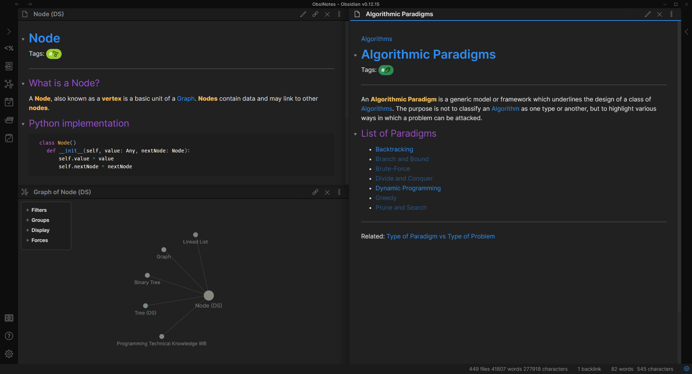
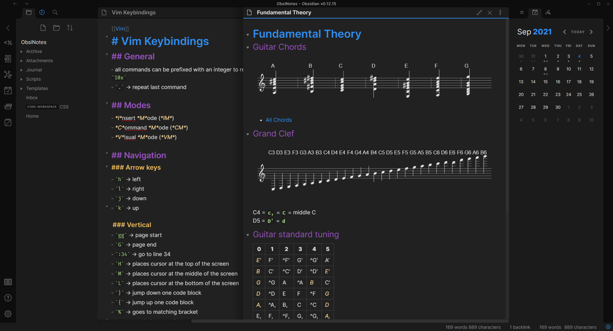
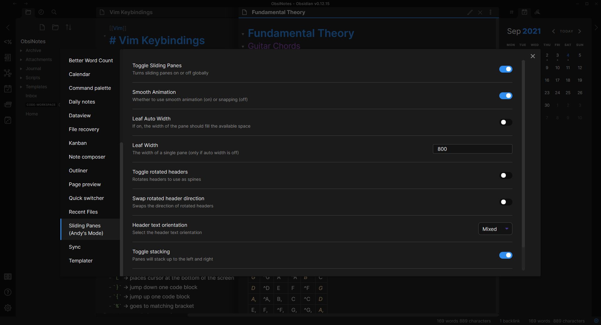

# Obsidian-material-theme

A theme for [Obsidian](https://obsidian.md/) inspired by the Material and Atom theme.

Only the dark theme is supported.

## Screenshots

## Installation

1. Download `material.css` to your Obsidian vaults themes folder: `.obsidian/themes/`.
2. In Obsidian, click Settings -> Plugins make sure `Custom CSS` is enabled

## Supported Plugins/JS Renderers
1. Abc.js
2. DataView
3. Kanban
4. Mathjax
5. Sliding Panels
6. Calendar

## Acknowledgements

Elements have been inspired by the [Atom theme](https://github.com/kognise/obsidian-atom)
